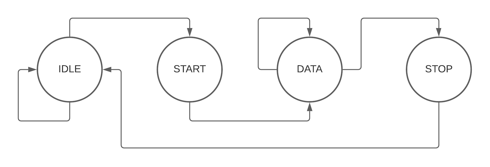
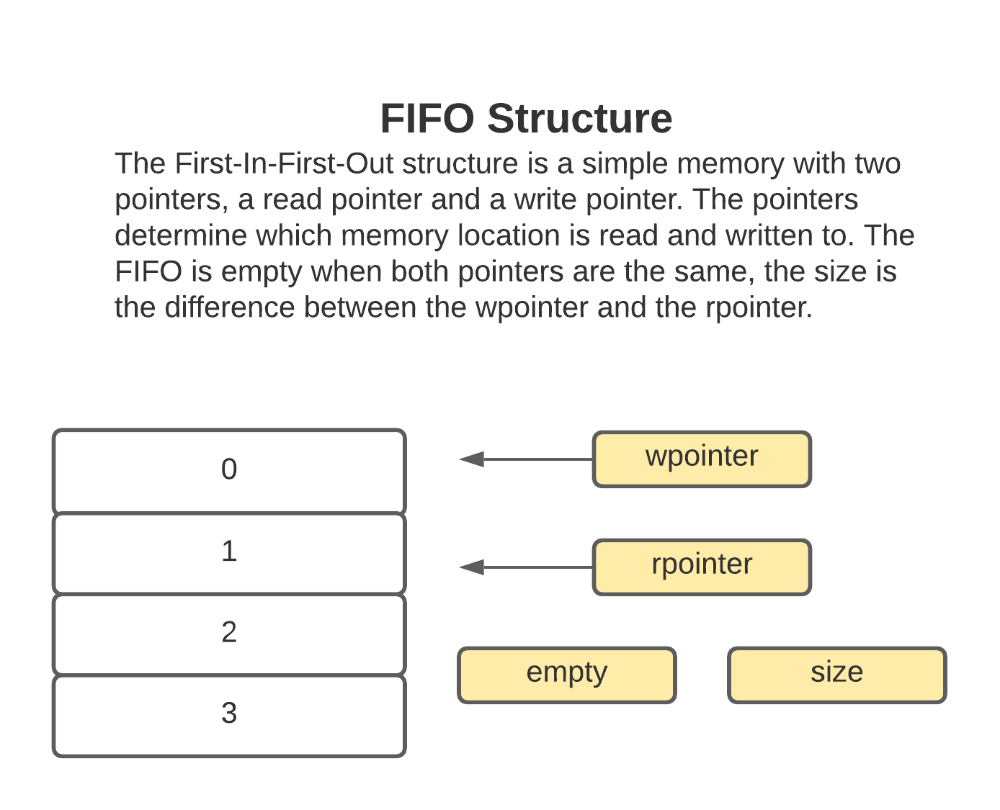
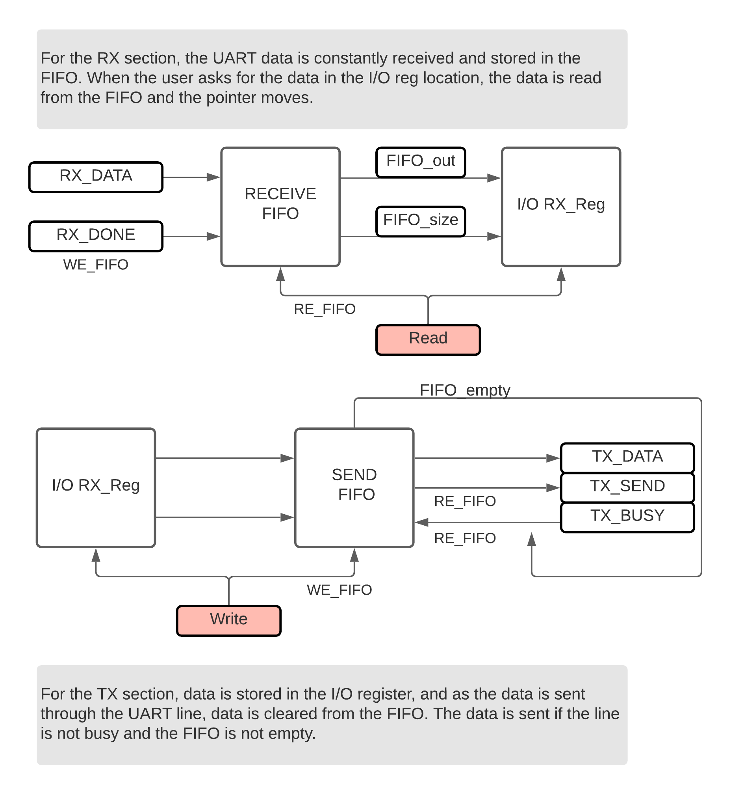

# rs-232

## Starting with the UART controller

The DE2-115 board has two channels for UART_TX and UARTX_RX. We want to create two controllers, one that will receive the serial packets and one that sends the serial packets. After finishing with the two controllers, we will create a system using two FIFO memories that will be designed to provide serial communication to the [RISC-V processor project](https://github.com/dgarci23/risc-v-32).

## TX and RX controllers

First, some information on the serial communication. The image below shows how the signal in the serial communication behaves in the data transmission. The transmission line is high when inactive (we will refer to this as the IDLE state). To send a signal, the line will go low for one period, this is known as the start bit, and we will use this state (START) to calibrate our receiver and be sure we are reading the bit close to the middle of the bit period. After the start bit, we will receive 7 bits of data (DATA state) and then an optional parity bit (which we will not use - for now). After sending the 7 bits, the signal goes high (the STOP state, then the IDLE state).

(https://developer.electricimp.com/resources/uart)

Both controllers, [RX](https://github.com/dgarci23/rs-232/blob/main/hdl/rx_controller.v) and [TX](https://github.com/dgarci23/rs-232/blob/main/hdl/tx_controller.v), operate on similar FSMs, but with different actions. The difference between the two controllers is whether we are receiving or sending data. The diagram of the FSM is shown below. To provide more information on both reading and writing, we will include two status flags, busy and done. Busy will go high when the TX controller is sending data, done will go high for one cycle at the end of the DATA state.

## FIFO

We will continue by creating two First-In-First-Out (FIFO) modules. FIFO means that the data goes out in the same order as it goes in. Since shifting values in memory is costly, a better solution is to have two pointers that represent where in our memory we are, the write pointer (to which location in memory we should write) and the read pointer (from what location in memory we should read). These two pointers get incremented as we read and write to the FIFO.

In our case we are interested in having two FIFOs, one at the input of the TX controller and one at the output of the RX controller. The FIFO in the receiving side will write all of the transmissions coming from the serial line, and reading the FIFO extracts the first transmission. The FIFO in the transmitting side will write all of the transmissions we want to send through serial and extract them if the serial send line is not busy and the FIFO is not empty. Using the FIFO ensures that we do not have to wait until the transmission is received or sent to work around it. We can queue multiple transmissions or wait until later to read the data received.

## UART + FIFO: The Final Design

Using the ideas we described above, we reach the final design. Below you can see a diagram of the system.

